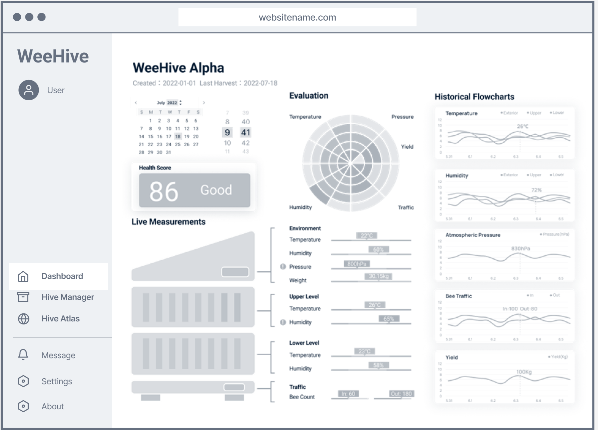
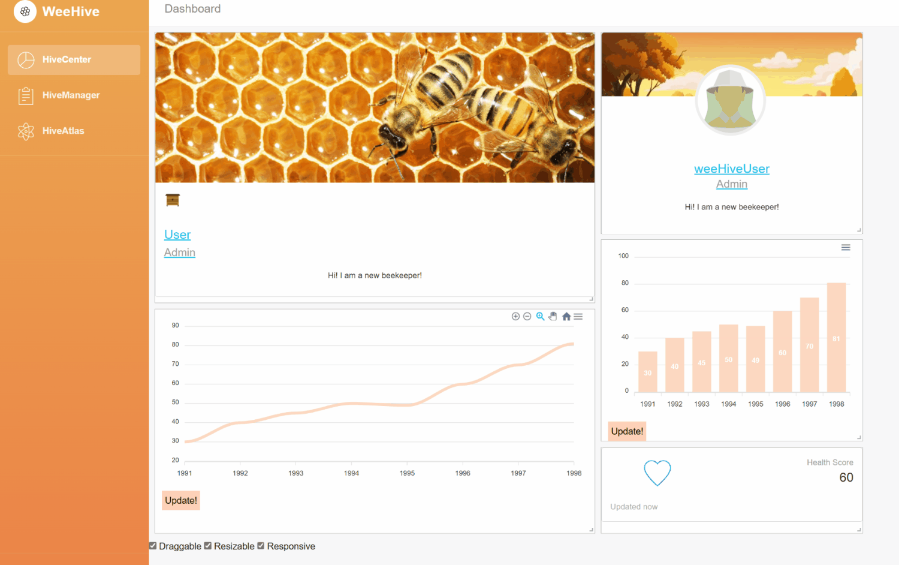

# README

### 1.1 PROJECT NAME AND SUMMARY

WeeHive is a data-driven, collaborative beekeeping platform designed to strengthen the mutualism between bees and humans under increasingly uncertain climate conditions.

The project put forward a self-sustained solution powered by injecting affordable technologies into existing beehives, following the principle of “to renovate not remake” to avoid unnecessary purchase of new production tools.

It consists of three major parts: a hardware renovation that introduces internet-of-things (IoT) for standard Langstroth Hives, a software cloud-based management portal for remote monitoring, and a platform for international beekeepers to collaboratively help and learn beekeeping experiences, forecast, and manage the risk under volatile weather conditions.

By harnessing the power of data, WeeHive provides beekeepers with valuable insights into the current state of their bee populations, helping them to mitigate risks of death and illness caused by extreme weather events. Moreover, the platform creates a supportive network for beekeepers who generate, collaborate, and learn new knowledge to tackle the serious challenges of harsh and uncertain climate conditions together.

The WeeHive is poised to become an actual product that will be adopted by farmers with smiling faces and contributes to the worldwide bee ecosystems. It demonstrates the future to improve the sustainability of honey agriculture and brighten the way we treat non-human creatures living with us.

With this project, I want to ignite public awareness of the long-overlooked agricultural sector. By injecting suitable technologies, we can prove that agriculture can be smart and sustainable. This small change will bring liveliness to this old but significant industry. Eventually, we aim to trigger a smart agriculture community with a new generation of farmer groups backed by technologies and survival wisdom in a new climate era.

**Project introduction video**: [https://youtu.be/p5F8pEr79TQ](https://youtu.be/p5F8pEr79TQ)

**Back End Server:** [https://github.com/srcJin/weehive-server](https://github.com/srcJin/weehive-server)

**Front End Client:** [https://github.com/srcJin/weehive-client](https://github.com/srcJin/weehive-client)

### **1.2 Low-fidelity UI Design**




### 1.3 FEATURES

**HiveCenter**

an interactive beehive monitorning dashboard. Farmers use the 


**Drag&Drop Responsive Layout**



**HiveManager**

A portal to register, edit, search and remove beehive information


**HiveAtlas**

An entry point for worldwide beekeepers to a data-driven agriculture community.
Users can view worldwide hive community, ask questions and get expert feedback backed by the sensor data and photos.


**User Panel**

Register, Edit, Search and Remove user information


**Edit Page**


### 1.3 SAMPLE MONGO DOCUMENTS

Add in a sample document from **each collection** you have in your MongoDB.

**user document**

```jsx
user: {
      userId: String,
      userName: String,
      password: String, // @todo password authentification
      email: String,
      adminType: Number,  //1:user、 2:collaborator
      icon: String,
      aboutMe: String,
      hiveId: Array
    },
    { timestamps: true }

```

**hive document**

```jsx
hive: {
      hiveId: String,
      hiveName: String,
      icon: {type: String, default: 'defaultHiveIcon.jpg'},
      userId: String,
      inspection: Array, // array of date
      location: Array,
      health: String,
      queenName: String,
      queenId: Number,
      frames: Array, // array of framd ids
      measurementsIds: Array, //
      comment: String
    },
    { timestamps: true }
```

**frame document**

```jsx
		frame:	{
				frameId: Number,
				type: Number, // 1: 
				floor: Number,
				index: Number, 
				inspectionDates: Array, // array of date
				harvest: Array,
				location: Array,
				icon: {type: String, default: 'defaultFrameIcon.jpg'},
				pictures: Array, // array of pictures
				hiveId: Number,
}
```

**measurement document**

```jsx
measurement**:** {
      hiveId: Number,
      date: { type: Date, default: Date.now },
      // array of objects
      measurements: {
        time: Date,
        value: {
          timestamp: Date,
          temperature_1: Number,
          temperature_2: Number,
          humidity: Number,
          lighting: Number,
          in: Number,
          out: Number,
          sound: Number,
        },
      },
    },
    { timestamps: true }
```

### 1.4 API DOCUMENTATION

You must provide a **write-up** for each of your API endpoints. Use the writeup format below:

API BaseURL: [https://weehive-server.onrender.com/api](https://weehive-server.onrender.com/api)

Temporarily deployed on onrender.com

**API Overview:**

Detailed Documentation: [APIDocument.md](APIDocument.md)


| USER |  |  |
| --- | --- | --- |
| Methods | Urls | Actions |
| GET | api/user | Get all user |
| GET | api/user/:userId | Get user by id |
| POST | api/user | Add new user |
| PUT | api/user/:userId | Update user by userId |
| DELETE | api/user/:userId | Remove user by userId |
| DELETE | api/user | Remove all user |
| GET | api/user?adminType=[kw] | Find all User which adminType contains 'kw' |
|  |  |  |
| HIVE |  |  |
| Methods | Urls | Actions |
| GET | api/hive | Get all hive |
| GET | api/hive/:hiveId | Get hive by id |
| POST | api/hive | Add new hive |
| PUT | api/hive/:hiveId | Update hive by hiveId |
| DELETE | api/hive/:hiveId | Remove hive by hiveId |
| DELETE | api/hive | Remove all hive |
| GET | api/hive?status>=50 | Find all hive which status is good |
|  |  |  |
| FRAME |  |  |
| Methods | Urls | Actions |
| GET | api/frame | Get all frame |
| GET | api/frame/:frameId | Get frame by id |
| POST | api/frame | Add new frame |
| PUT | api/frame/:frameId | Update frame by frameId |
| DELETE | api/frame/:frameId | Remove frame by frameId |
| DELETE | api/frame | Remove all frame |
| GET | api/frame?adminType=[kw] | Find all frame which adminType contains 'kw' |
|  |  |  |
| MEASUREMENT |  |  |
| Methods | Urls | Actions |
| GET | api/measurement | Get all measurement |
| GET | api/measurement/:measurementId | Get measurement by id |
| POST | api/measurement | Add new measurement |
| PUT | api/measurement/:measurementId | Update measurement by measurementId |
| DELETE | api/measurement/:measurementId | Remove measurement by measurementId |
| DELETE | api/measurement | Remove all measurement |
| GET | api/measurement?adminType=[kw] | Find all measurement which adminType contains 'kw' |

### 1.5 CREDITS

Put here all the code, content and assets that you have used. If you have used a piece of code from an external website, please acknowledge it and provide a link to it.

Vue Bootstrap Dashboard Template: [https://github.com/creativetimofficial/light-bootstrap-dashboard](https://github.com/creativetimofficial/light-bootstrap-dashboard)

Vue2 Leaflet: [https://vue2-leaflet.netlify.app/](https://vue2-leaflet.netlify.app/)

Vue Grid Layout: [https://jbaysolutions.github.io/vue-grid-layout/](https://jbaysolutions.github.io/vue-grid-layout/)

Vue.js + Node.js + Express + MongoDB example: [https://www.bezkoder.com/vue-node-express-mongodb-mevn-crud/](https://www.bezkoder.com/vue-node-express-mongodb-mevn-crud/)

ApexChart Vue:  [https://apexcharts.com/docs/vue-charts/](https://apexcharts.com/docs/vue-charts/)